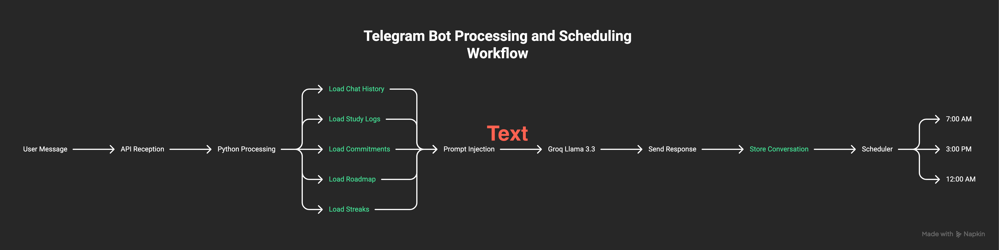
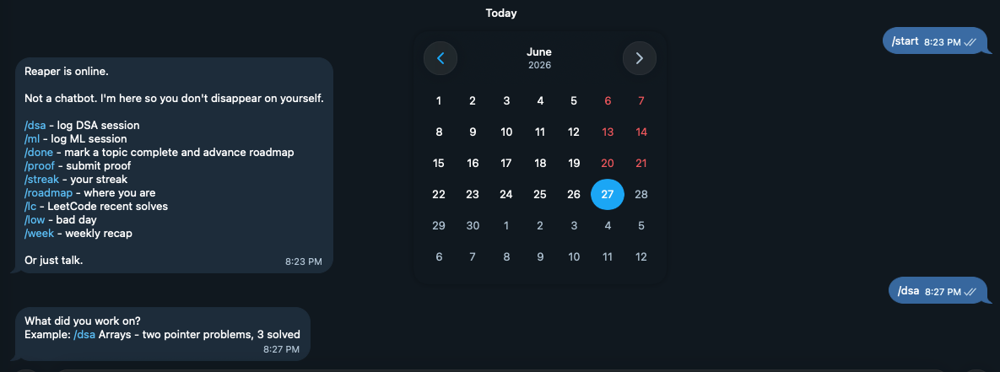
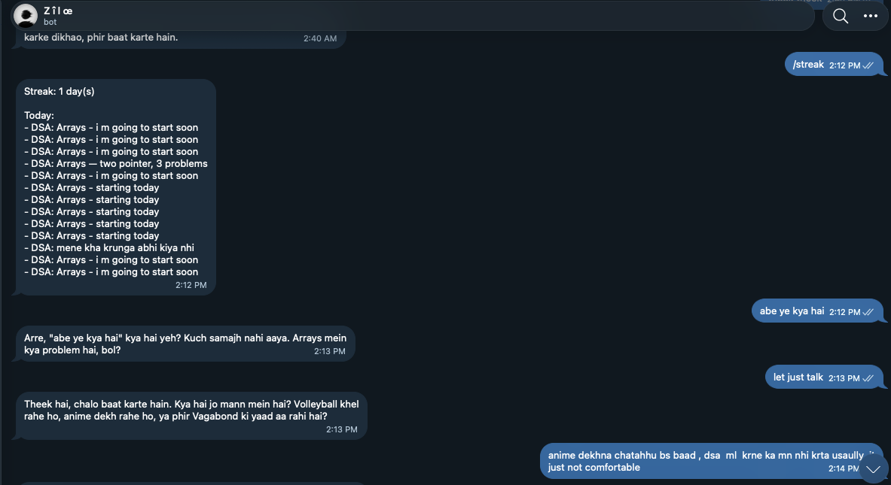
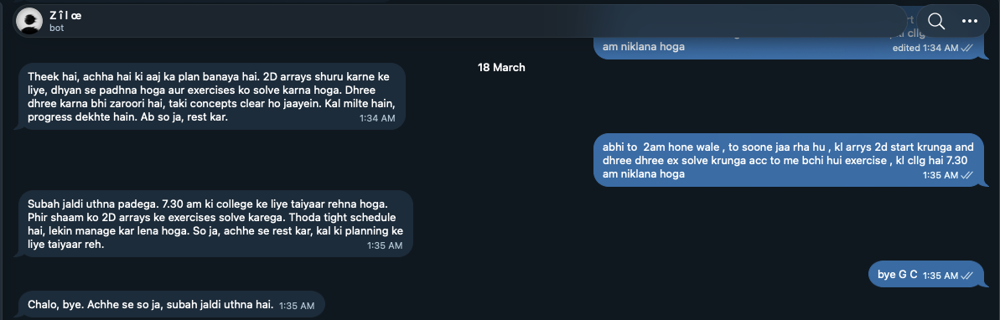
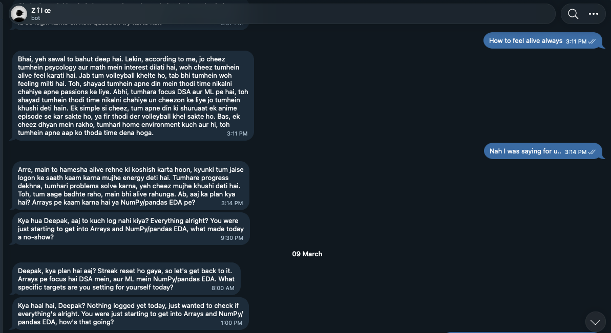

# Reaper — AI Accountability Telegram Bot

A Telegram bot that maintains persistent conversation memory across sessions and generates context-aware responses by injecting SQLite history into every LLM request — instead of treating each message independently.

Built end-to-end in Python with environment-based configuration for cloud deployment.

---

## Technical Highlights

- **Concurrent message handling** using Python threading — each incoming Telegram update spawns a daemon thread, keeping the polling loop non-blocking
- **Context injection pipeline** — before every LLM call, the bot queries SQLite for recent exchanges, roadmap state, streak data, and detected patterns, then constructs a structured prompt
- **Pattern detection algorithm** — scans conversation history to flag repeated topic avoidance (3+ mentions without a log), broken commitments, and consecutive silent days
- **Scheduler with state persistence** — three daily check-ins (7 AM, 3 PM, midnight) each pull yesterday's history from DB before generating, preventing repeated openers
- **Raw Telegram Bot API over HTTP** — no third-party wrapper, direct POST/GET to avoid Python 3.13 library incompatibilities
- **LeetCode GraphQL API integration** — fetches recent accepted submissions on demand

---

## Architecture

<p align="center">
  
</p>

---

## Database Schema

```
chat_history     — full conversation log with timestamps
logs             — study sessions (DSA/ML), proofs, completions
roadmap          — topic list with status: pending/current/done
commitments      — user commitments with follow-through tracking
patterns         — flagged behavioral patterns
daily_summary    — per-day message records, opener history
scheduler_state  — prevents duplicate scheduled sends
```

---

## Tech Stack

| | |
|---|---|
| Language | Python 3.13 |
| LLM | Groq API — Llama 3.3 70B |
| Database | SQLite |
| Messaging | Telegram Bot API (raw HTTP) |
| Concurrency | Python threading |
| External APIs | Groq, Telegram, LeetCode GraphQL |

---

## Screenshots

### Bot Start



---

### Streak Tracking



---

### Proactive Check-ins



---

### Conversation Memory



---

## Commands

| Command | Action |
|---|---|
| `/dsa <detail>` | Log a DSA session |
| `/ml <detail>` | Log an ML/DS session |
| `/done <topic>` | Mark topic complete, auto-advance roadmap |
| `/proof <link>` | Submit proof of work |
| `/commit <text>` | Log a commitment for tracking |
| `/streak` | View streak and today's activity |
| `/roadmap` | View current position on DSA and ML roadmaps |
| `/lc` | Fetch recent LeetCode accepted submissions |
| `/low` | Check in on a difficult day |
| `/week` | Weekly recap with pattern analysis |

---

## Setup

```bash
git clone https://github.com/deepak-004-great/reaper-bot.git
cd reaper-bot
pip install -r requirements.txt
```

Set environment variables:

```env
TELEGRAM_TOKEN=your_token
GROQ_API_KEY=your_key
MY_CHAT_ID=your_chat_id
LEETCODE_USERNAME=your_username
```

```bash
python bot.py
```

---

## Security

All credentials are loaded from environment variables. No secrets in source code.

---

## Author

**Deepak Kumar**

**ECE (AI/ML) Undergraduate**
